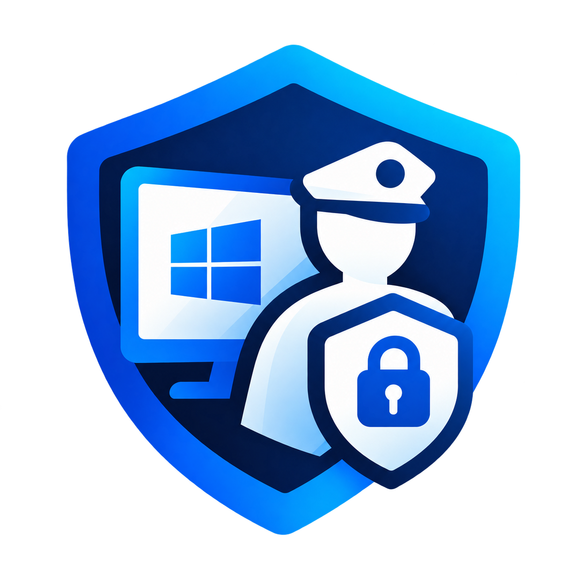

# 🛡️ Nazoratchi - Mukammal Nazorat va Filtrlash Tizimi

<p align="center">
  
</p>

<p align="center">
  <b>O'quv markazlari, maktablar va tashkilotlar uchun kompyuter va internetni markazlashgan nazorat qilish tizimi</b>
</p>

<p align="center">
  
  
  
  
  
</p>

---

## 📌 Loyiha Haqida

**Nazoratchi** — Windows operatsion tizimi uchun mo'ljallangan, ko'p qatlamli xavfsizlik va cheklovlar tizimi. U o'quv markazlari, maktab sinfxonalari va korporativ muhitlarda foydalanuvchilarning chalg'ishini oldini olish, nomaqbul saytlar hamda dasturlar bilan ishlashni cheklash uchun ishlab chiqilgan.

Tizim **fon xizmati (Windows Service)** va zamonaviy **WPF boshqaruv paneli (Material Design)** dan iborat bo'lib, standart foydalanuvchilar tomonidan o'chirib tashlanishi yoki chetlab o'tilishiga qarshi kuchli himoyaga ega.

---

## ✨ Asosiy Imkoniyatlar

### 1. 🌐 DNS Veb-Filtrlash (LeechBlock NG Uslubidagi Qoidalar)
- **Alohida Qora va Oq ro'yxatlar:** Har bir rejim uchun alohida veb-saytlar ro'yxati boshqariladi.
- **LeechBlock NG filtrlash sintaksisi:**
  - `*` — Wildcard (namuna): `*game*`, `*.youtube.com`
  - `+` — Istisno qoidasi: `+developer.mozilla.org`
  - `~` — Domen ichidan kalit so'z bo'yicha qidirish: `~bet`, `~casino`
  - Aniq domenlar va ularning barcha subdomenlarini to'liq bloklash.
- **Ommaviy kiritish (Bulk Import):** Bir nechta sayt domenlarini yangi qator bilan birdaniga ro'yxatga qo'shish.
- **Tartiblash va tozalash:** Domenlarni alifbo bo'yicha saralash va qidiruv tizimi.
- **DNS Cache avtomatik tozalash va DoH (DNS over HTTPS) ni o'chirish** orqali aylanib o'tishlarning oldini olish.

### 2. 🚫 Dasturlar O'rnatilishi va O'chirilishini Cheklash (3 Bosqichli Himoya)
- **1-bosqich (200ms Window Guardian):** O'rnatish yoki dasturlarni o'chirish oynalarini (`Uninstall`, `O'chirish`, `Удаление`, `Setup`, `Installer`) har 200 millisekundda aniqlab, darhol yopadi.
- **2-bosqich (Windows Registry Siyosatlari):**
  - `DisableMSI = 2` — Windows Installer paketlari (msi) butunlay bloklanadi.
  - `NoAddRemovePrograms = 1` — Boshqaruv panelidagi dasturlarni o'chirish bo'limiga kirish taqiqlanadi.
- **3-bosqich (WMI Real-time Process Scanner):** Xavfli jarayonlar (`unins000.exe`, `uninstall.exe`, `setup.exe`) paydo bo'lishi bilanoq 1 soniya ichida to'xtatiladi.

### 3. 🔐 Administrator Himoyasi va Qayta Tiklash
- **SHA-256 + Tuzlangan (Salted) Parol:** Xavfsiz parollash algoritmi.
- **Qayta Tiklash Kaliti (Recovery Key):** Administrator paroli unutilgan holatda 8 xonali noyob shifrlangan kalit orqali parolni yangilash imkoniyati.
- Barcha konfiguratsiyalar `C:\ProgramData\Nazoratchi\` papkasida xavfsiz saqlanadi.

### 4. ⚙️ Tizim Arxitekturasi
- **Nazoratchi.Core:** Ma'lumotlar modeli, konfiguratsiya boshqaruvi, LeechBlock filtri va umumiy yordamchi xizmatlar.
- **Nazoratchi.Service:** Windows Service foni (LocalSystem darajasida mustaqil ishlaydi, DNS proksi va jarayonlar nazoratchisi).
- **Nazoratchi.Panel:** Administrator uchun chiroyli va qulay WPF interfeysi (Material Design).

---

## 🚀 O'rnatish va Ishga Tushirish

### Talablar
- **OT:** Windows 10 / Windows 11 (x64)
- **Platforma:** [.NET 8.0 SDK / Runtime](https://dotnet.microsoft.com/download/dotnet/8.0)
- **Huquq:** Administrator huquqlari (Administrator sifatida ishga tushirish talab qilinadi)

### Loyihani Kompilyatsiya Qilish
```powershell
# Loyihani klonlash
git clone https://github.com/T-Iskandarov/Nazoratchi.git
cd Nazoratchi

# To'liq yechimni yig'ish (Build)
dotnet build Nazoratchi.sln -c Release
```

### Boshqaruv Bat-fayllari
- `Panelni_Ochish.bat` — Administrator panelini ochish.
- `Xizmatni_Yoqish.bat` — Tizim servisini o'rnatish va ishga tushirish.
- `Xizmatni_Toxtatish.bat` — Servisni to'xtatish va tarmoq sozlamalarini asl holiga qaytarish.

---

## 👨‍💻 Muallif va Rivojlantiruvchi

- **Dastur Muallifi:** Tursunpo'lat Iskandarov
- **Ishlab Chiquvchi:** [CUBO](https://cubo.uz) kompaniyasi
- **Rasmiy Sayt:** [https://cubo.uz](https://cubo.uz)

---

## 📄 Litsenziya
Ushbu loyiha maxsus buyurtma asosida o'quv markazlari xavfsizligi va nazorati uchun ishlab chiqilgan.
Barcha huquqlar himoyalangan © CUBO.
